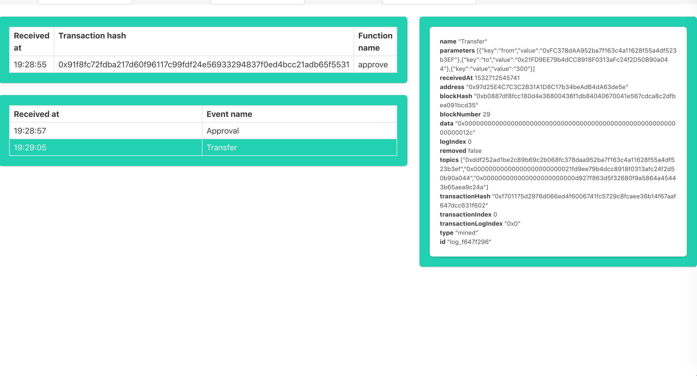
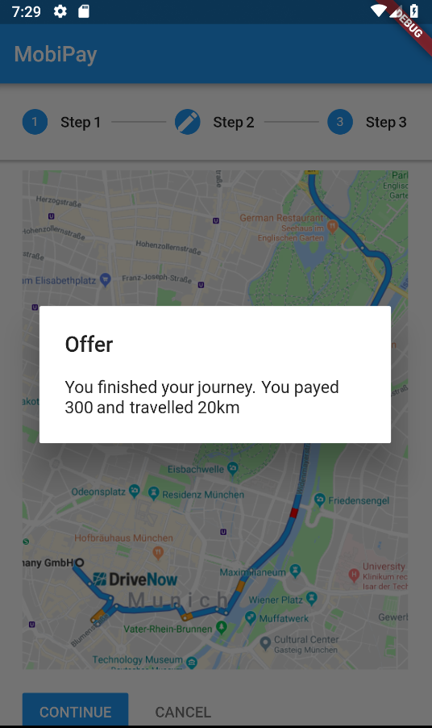

# Application steps

## Stage 1

#### App is starting

___

### User selects destination

___

### Amadeus API returns proposed offers

___

## Stage 2

### User is directed to the mean of transportation

___

### When near by car/station etc., service provider hardware connects to Amadeus API and proposes the travel. (Postman for simulation)

___

### This is recorded in the blockchain

___

### User gets prompt if he do accept the offer

___

### Both accept and decline decision is saved on blockchain, on the Mobility service smart contract

___

## Stage 3

### User enters the mean of transportation, service provider hardware detects it and registers it on blockchain

___

### This is recorder on the blockchain, on the Mobility service smart contract

___

### User gets notification that his journey has started

___

## Stage 4

### User exits the mean of transportation, service provider hardware detects it and registers it on blockchain

___

### This is recorder on the blockchain, on the Mobility service smart contract

___

### When executing Mobility service, different ERC Tokens can be used as a service. In this example it is `EuroToken`. Transfer is executed from user to the service provider. Tokens are interchangeable.

___

### User gets notification that his journey has finished, with paid amount and distance traveled

