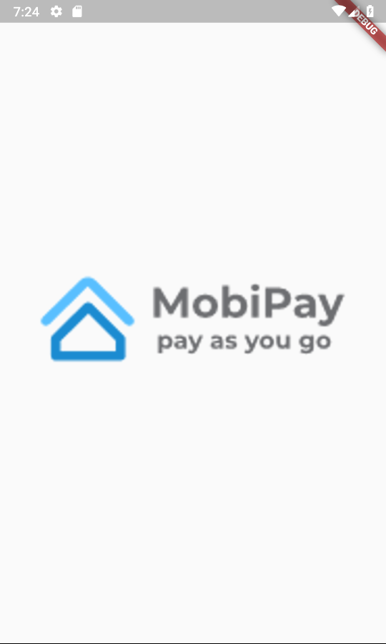
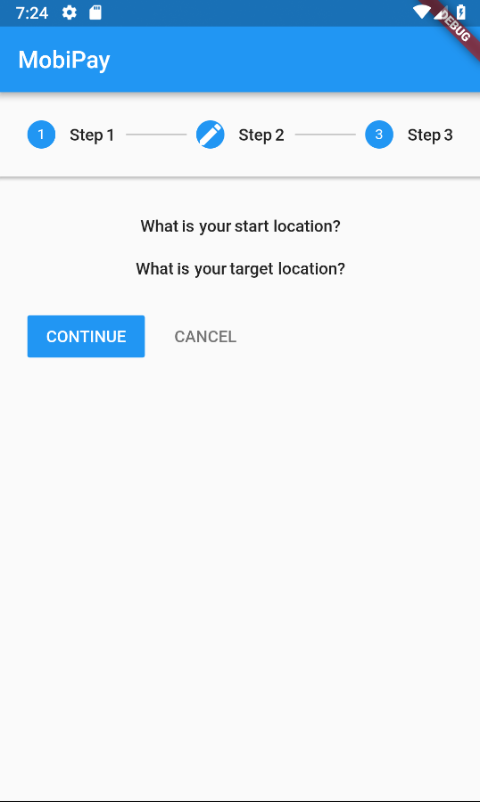
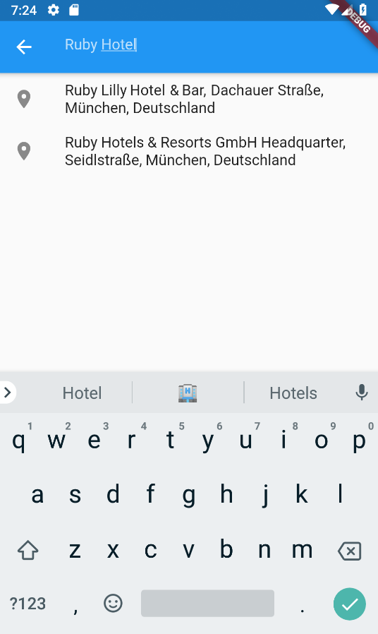
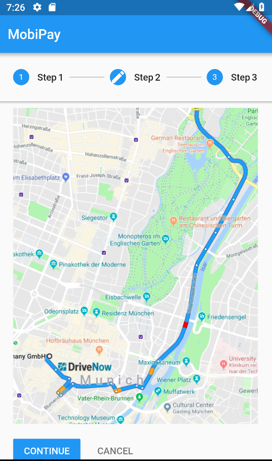
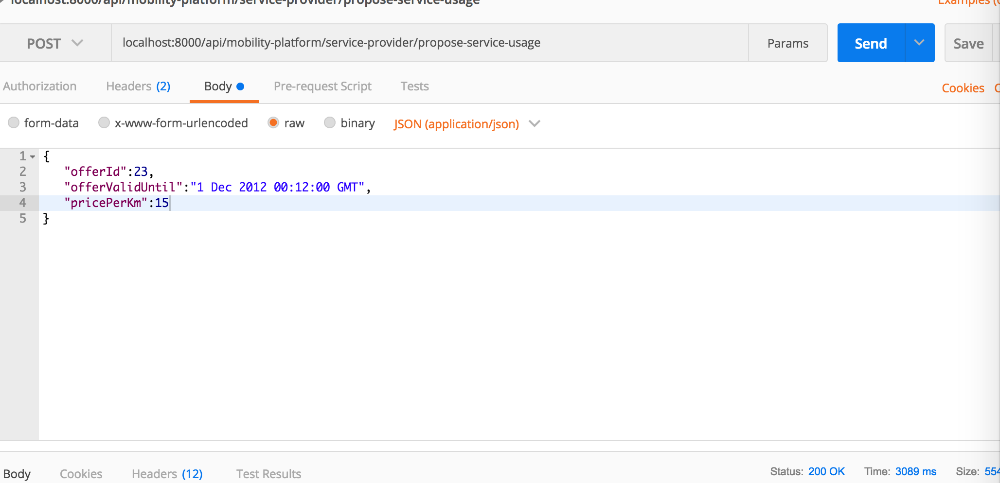
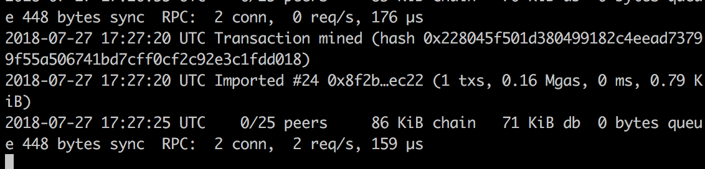
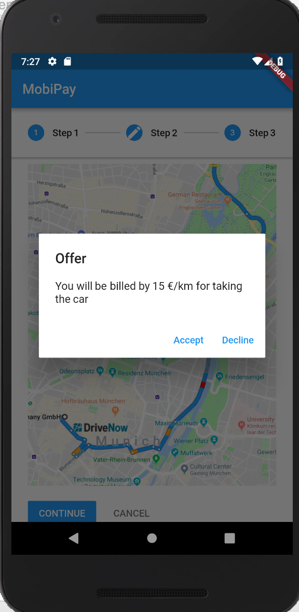
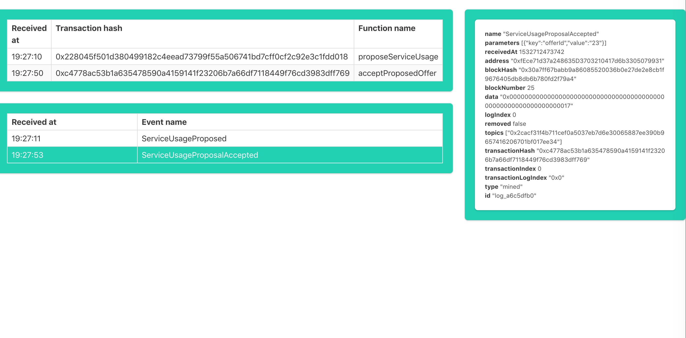

# Application steps

## Stage 1

#### App is starting

### User selects destination

### Amadeus API returns proposed offers

## Stage 2

### User is directed to the mean of transportation

### When near by car/station etc., service provider hardware connects to Amadeus API and proposes the travel. (Postman for simulation)

### This is recorder in the blockchain

### User gets prompt if he do accept the offer

### Both accept and decline decision is saved on blockchain

